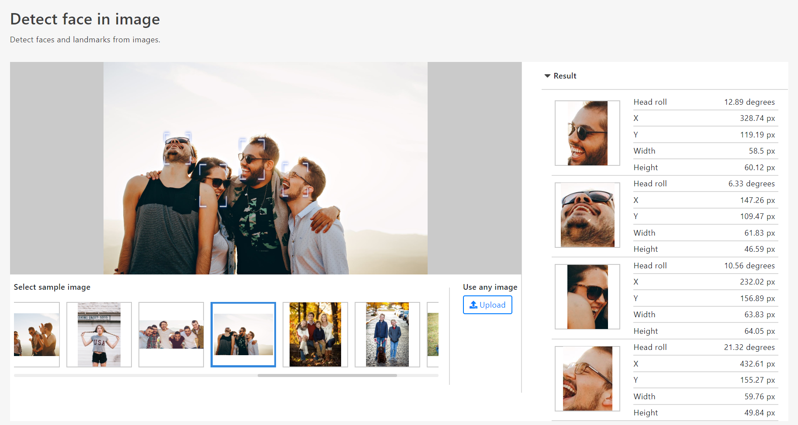

# xtejs-detection

<!--  -->


**XteJS detection** is a library that detects various things such as faces and licenses.

### &nbsp;<!-- Code required for line break in README header -->

## Introduction

XtejsDetection is a library that anyone can easily detect faces and objects in the browser.  

We also offer a highly accurate face recognition platform and OCR.  
For more information, please contact us via Facebook message (https://www.facebook.com/takuya.motoshima.7/) or email (developer.takuyamotoshima@gmail.com).

#### Browser Compatibility

XtejsDetection supports all browsers that are ES5-compliant (IE8 and below are not supported).

Example of detecting faces from webcam.

<!--  -->


Example of detecting faces from images.

<!--  -->


Example of detecting faces from video.

<!--  -->


## Installation

Install.

```sh
npm install xtejs-detection;
```

Copy model manifests and weights (shards) required for face detection to public directory

```
cp -a node_modules/xtejs-detection/dist/models {Your public directory path};
```

## Usage

### Face detection from web camera.

```js
// HTML: <video id="webcam" playsinline muted></video>

import { FaceDetector } from 'xtejs-detection';

// Open web camera
const webcam = document.querySelector('#webcam');
webcam.srcObject = await navigator.mediaDevices.getUserMedia({ video: true, audio: false });
await new Promise(resolve => webcam.addEventListener('loadedmetadata', () => {
  webcam.play();
  resolve();
}));

// Face detector instance
const detector = new FaceDetector(document.querySelector('#webcam'));

// Attach the face detector
await detector.attach({ models: '../dist/models' });

// Detector event listeners
detector.on('detected', results => {
  for (let result of results || []) {
    // Draw face bounding box
    result.drawFaceRect();
    // Get Face image in base64 format
    const thumbnail = result.thumbnail;
  }
});

// Start face detection
detector.realTimeDetection();
```

### Detect face from video.

```js
// HTML: <video id="video" src="sample.mp4" playsinline loop></video>

import { FaceDetector } from 'xtejs-detection';

// Face detector instance
const detector = new FaceDetector(document.querySelector('#video'));

// Attach the face detector
await detector.attach({ models: 'models' });

// Detector event listeners
detector.on('detected', results => {
  // Draw face bounding box
  for (let result of results || []) result.drawFaceRect();
});

// Play video
document.querySelector('#video').play();

// Start face detection
detector.realTimeDetection();

// Stop face detection
detector.cancelRealTimeDetection();
````

### Detect face from image.

```js
// HTML: 

import { FaceDetector } from 'xtejs-detection';

// Face detector instance
const detector = new FaceDetector(document.querySelector('#image'));

// Attach the face detector
await detector.attach({ models: 'models' });

// Detect face from image
const results = await detector.detection();

for (let result of results || []) {
  // Draw face bounding box
  result.drawFaceRect();
  // Get Face image in base64 format
  const thumbnail = result.thumbnail;
}
```

## API Reference

* <h3>Class: FaceDetector</h3>

    This class detects faces from web cameras, images, and videos.

    * <h4>new FaceDetector(input) </h4>

        Construct a new FaceDetector

        ___Parameters:___

        |Name|Type|Description|
        |-|-|-|
        |input|HTMLImageElement\|HTMLVideoElement|Media elements for webcams, videos and images that detect faces|

        ___Examples:___

        ```js
        // HTML: <video id="webcam" playsinline muted></video>

        import { FaceDetector } from 'xtejs-detection';

        // Open web camera
        const webcam = document.querySelector('#webcam');
        webcam.srcObject = await navigator.mediaDevices.getUserMedia({ video: true, audio: false });
        await new Promise(resolve => webcam.addEventListener('loadedmetadata', () => {
          webcam.play();
          resolve();
        }));

        // Face detector instance
        const detector = new FaceDetector(document.querySelector('#webcam'));
        ```

    * <h4>Methods</h4>

        * <h5>async attach(options)</h5>

            Attach face detection features to devices

            ___Parameters:___

            |Name|Type|Description|
            |-|-|-|
            |options|Object|Options to attach face detector to device<br>___Property___<br><table><thead><tr><th>Name</th><th>Type</th><th>Description</th></tr></thead><tbody><tr><td>models</td><td>string</td><td>The path where the model manifest and weights (shards) files are stored.<br>These are located in "https://github.com/takuya-motoshima/xtejs-detection/tree/master/dist/models", so copy them to your application's public directory.</td></tr><tr><td>numberOfDetection</td><td>number</td><td>Maximum number of faces to detect.<br>The default is 100.</td></tr><tr><td>motions</td><td>boolean</td><td>Detects facial motion.<br>When on, the head angle is added to the detection results.<br>The default is off.</td></tr></tbody></table>|

            ___Returns:___

            Promise\<void\>

            ___Examples:___

            ```js
            // Attach the face detector
            await detector.attach({ models: 'models', numberOfDetection: 100, motions: true });
            ```

        * <h5>async detection()</h5>

            Detect face

            ___Returns:___

            Returns the detection result object.  
            If the option numberOfDetection is 1, FaceDetectResult object is returned. If it is 2 or more, FaceDetectResult array is returned. If not detected, NULL is returned.

            Promise<FaceDetectResult[]|FaceDetectResult|null>

            ___Examples:___

            ```js
            // Detect face
            const results = await detector.detection();
            // results:
            // [
            //   {
            //     rect: {
            //       x: 545.91,
            //       y: 190.72,
            //       width: 277.37,
            //       height: 212.27
            //     },
            //     thumbnail: 'data:image/png;base64,iVBORw0...',
            //     roll: 40.16
            //   }
            // ]
            ```

        * <h5>realTimeDetection()</h5>

            Start real-time face detection.  
            This is used when detecting a face from a web camera or video where the image is constantly changing.

            ___Examples:___

            ```js
            // Start face detection
            detector.realTimeDetection();
            ```

        * <h5>cancelRealTimeDetection()</h5>

            Stop real-time face detection.  
            It is used when the WEB camera and video are paused.

            ___Examples:___

            ```js
            // Stop face detection
            detector.cancelRealTimeDetection();
            ```

        * <h5>on(type, listener)</h5>

            Set up a real-time detection event for the face detector.

            ___Parameters:___

            |Name|Type|Description|
            |-|-|-|
            |type|string|Event name<br><table><thead><tr><th>Event name</th><th>Description</th></tr></thead><tbody><tr><td>detected</td><td>Invoke when face detection is completed.</td></tr><tr><td>beforedetection</td><td>Invokes just before detecting a face.</td><tr></tbody></table>|
            |listener|Function|A callback that receives notification of events.<br>___Callback parameters___<br><table><thead><tr><th>Event name</th><th>Parameters</th></tr></thead><tbody><tr><td>detected</td><td><table><thead><tr><th>Name</th><th>Type</th><th>Description</th></tr></thead><tbody><tr><td>results</td><td>FaceDetectResult[]\|FaceDetectResult\|null</td><td>Returns the detection result object.<br>If the option numberOfDetection is 1, FaceDetectResult object is returned. If it is 2 or more, FaceDetectResult array is returned. If not detected, NULL is returned.</td></tr></tbody></table></td></tr><tr><td>beforedetection</td><td>There are no parameters.</td><tr></tbody></table>|

            ___Returns:___

            FaceDetector

            ___Examples:___

            ```js
            // Detector event listeners
            detector
              .on('detected', results => {
                for (let result of results || []) {
                  // Draw face bounding box
                  result.drawFaceRect();
                  // Get Face image in base64 format
                  const thumbnail = result.thumbnail;
                }
              })
              .on('beforedetection', results => {
                // Do something just before detection
              });

            // Start face detection
            detector.realTimeDetection();
            ```

* <h3>Class: FaceDetectResult</h3>

    This is the face detection result.

    * <h4>Members</h4>

        * <h5>readonly rect: Object</h5>

            The bounding box of the detected face.

            ___Property___
            |Name|Type|Description|
            |-|-|-|
            |x|number|The X coordinate of the face bounding box.|
            |y|number|The Y coordinate of the face bounding box.|
            |width|number|The width of the face bounding box.|
            |height|number|The height of the face bounding box.|

        * <h5>readonly roll: numbe</h5>

            The roll angle of the head.

        * <h5>readonly thumbnail: string</h5>

            A face image detected in Base64 format.

    * <h4>Methods</h4>

        * <h5>drawFaceRect()</h5>

            Draw face bounding box.

            ___Examples:___

            ```js
            // When detecting faces from images/
            // Detect face from image
            const results = await detector.detection();
            // Draw face bounding box
            for (let result of results || []) result.drawFaceRect();

            // When detecting a face from a web camera or video
            // Detector event listeners
            detector.on('detected', results => {
              // Draw face bounding box
              for (let result of results || []) result.drawFaceRect();
            });

            // Start face detection
            detector.realTimeDetection();
            ```

## Examples

There are some examples in "./examples" in this package.Here is the first one to get you started.

## Credits

The original model, weights, code, etc. was created by face-api.js and can be found at https://github.com/justadudewhohacks/face-api.js/
This port and my work is in no way related to face-api.js.

## License

[MIT licensed](./LICENSE.txt)